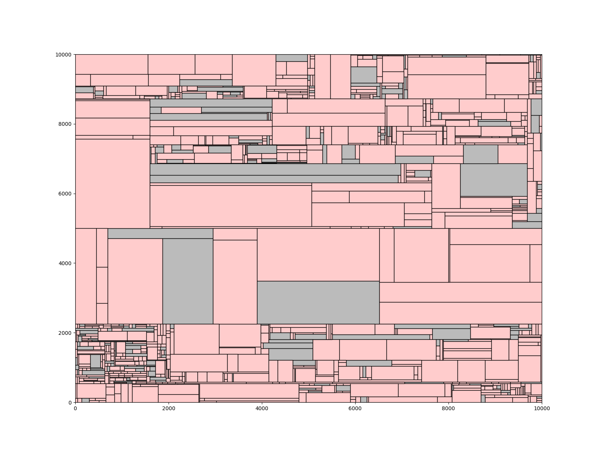
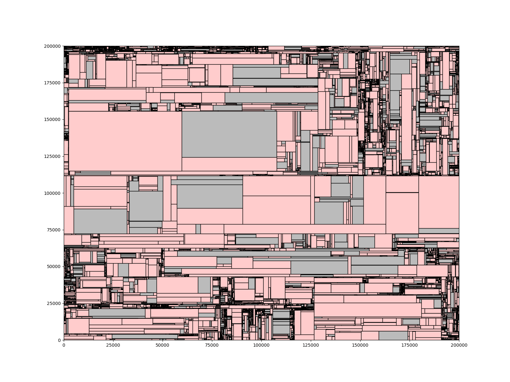
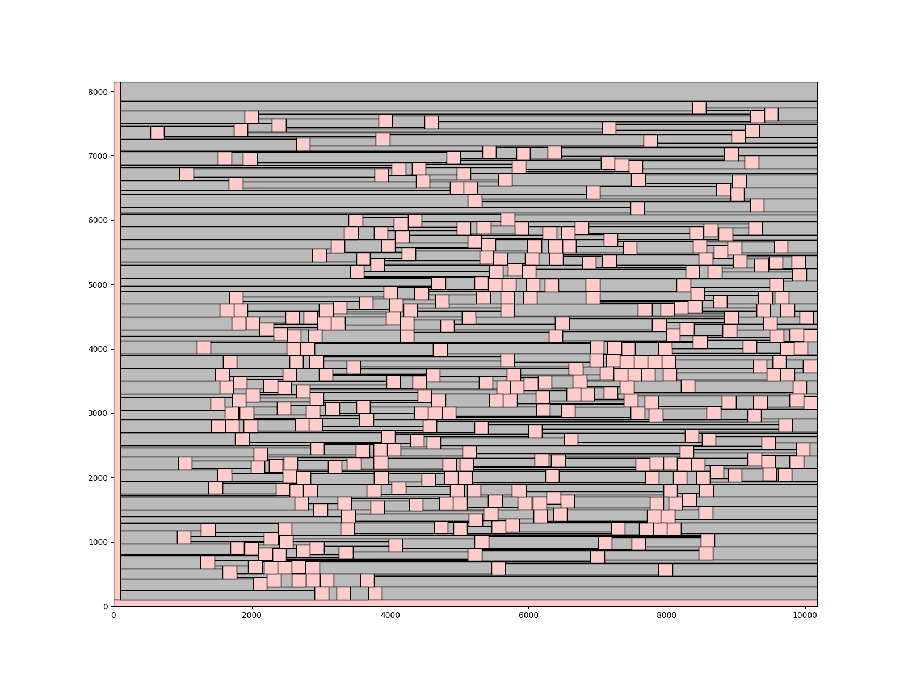
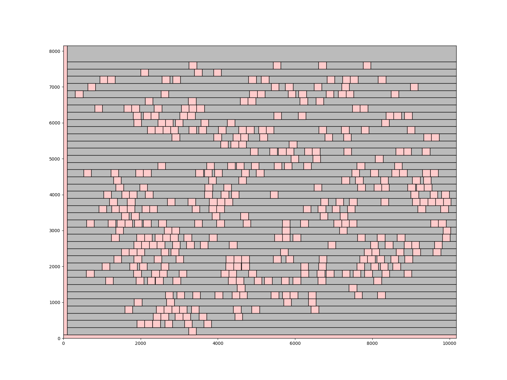

# Corner Stitching

## Overview
This project implements the ***Corner Stitching*** data structure for efficient spatial data management. <br>
The goal is to organize space tiles as maximal horizontal stripes, ensuring no adjacent space tiles exist on the left or right while maximizing tile width.

For more details, refer to: [2024PDA_Lab1.pdf](2024PDA_Lab1.pdf)

## Implementation
This project provides the following core functionalities:
- Point Finding - Given a coordinate (x, y), efficiently determine which tile covers that position.
- Block Insertion – Dynamically insert blocks while maintaining adjacency relationships.
- Enumerate All Tiles – Traverse and output all tiles in the corner stitching structure.

## Files Structure
```sh
📂 Lab1/
├── 📁 drawing/                 # Layout images 
├── 📁 inc/                     # Header files
├── 📁 layout/                  # txt files for visualization
├── 📁 obj/                     # Compiled object files (generated during compilation)
├── 📁 output/                  # Output txt files
├── 📁 src/                     # Source files
├── 📁 testcase/                # Testcases
├── 📄 2024PDA_Lab1.pdf         # Detailed problem description
├── 📄 Lab1 Supplementary.pdf   # Supplementary
├── ⚙️ Makefile                 # Build automation script
├── 🖼️ draw.sh                  # Script to generate images automatically
├── 🖥️ draw_block_layout.py     # Python script for visualization
└── 📜 main.cpp                 

```

## Compilation
To compile all source files, run the following command:
```sh
make
```
This will compile all source files and generate an executable file - Lab1.

## Execution
To process the program, use:
```sh
make exe
```

## Generating Visualization Layout Images
You can visualize the final layout using the provided scripts:
```sh
bash draw.sh
```

## Clean Up
To remove all compiled object files, generated output images and txt, run:
```sh
make clean
```
This will delete the obj/ , output/ and layout/ directories as well as the executable files.

## Results
| layout4.png                      | layout5.png                      |
|:--------------------------------:|:--------------------------------:|
|  |  |

| layout6.png                      | layout7.png                      |
|:--------------------------------:|:--------------------------------:|
|  |  |
