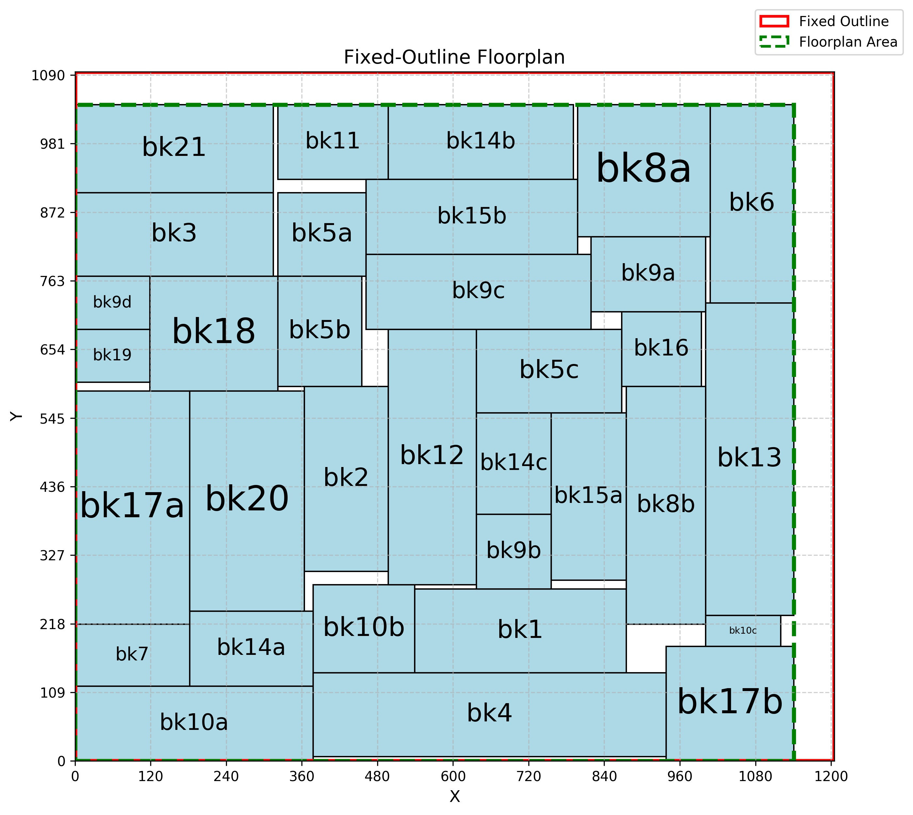
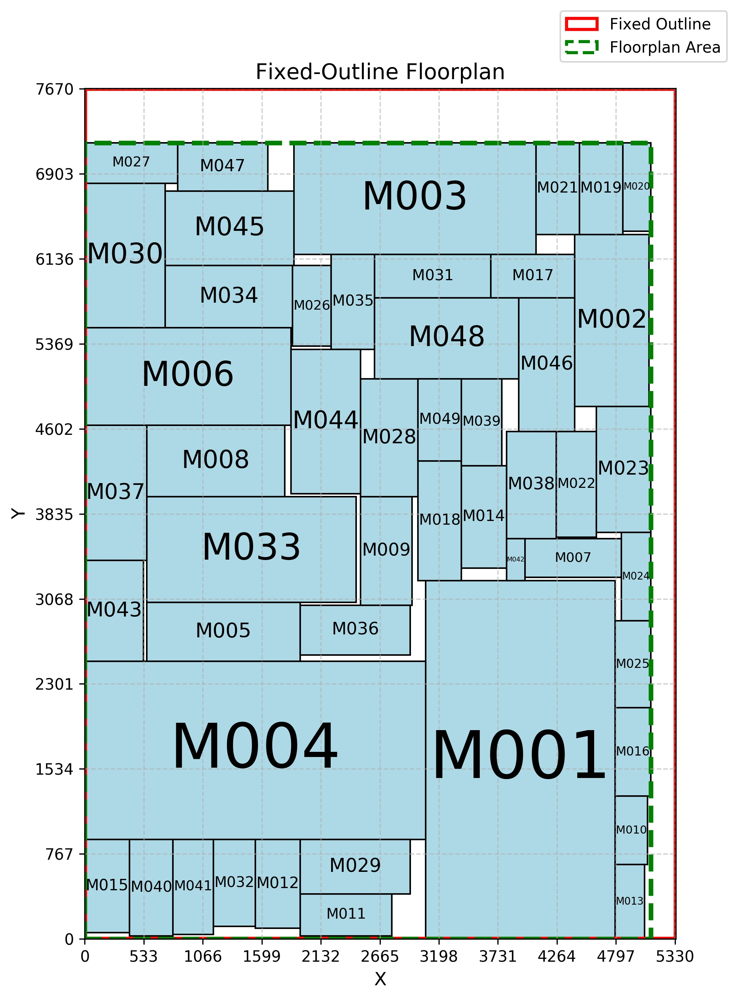
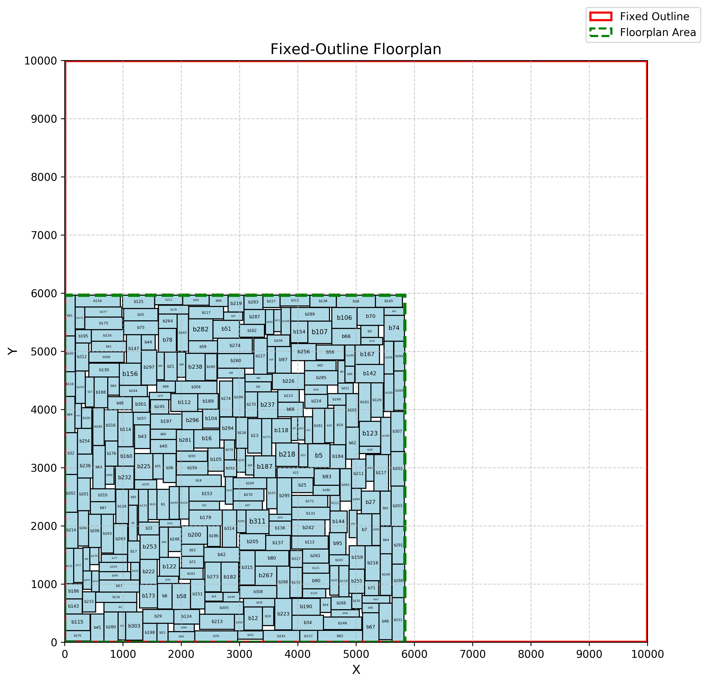

# Fixed Outline Floorplanning using Sequence Pair

## Overview
This project implements the ***Fixed-Outline Floorplanner***  for placing hard macros within a given rectangular chip without overlaps. 
The goal is to optimize the bounding-box area and total wirelength while respecting the given chip outline.

The cost function is defined as:

$$ Cost=αA+(1−α)W $$

where:
- A is the bounding-box area of the floorplan.
- 𝑊 is the total wirelength, computed using Half-Perimeter Wire Length (HPWL).
- 𝛼 is a user-defined weight (0 ≤ α ≤ 1).
- The cost must be an integer.


For more details, refer to: [Lab2.pdf](Lab2.pdf)

## Implementation
This project employs ***Sequence Pair Representation*** combined with ***Simulated Annealing*** to efficiently explore the solution space and optimize fix-outline floorplan.
- Simulated Annealing – A probabilistic optimization technique used to escape local minima and achieve global optimization in minimizing cost.
- Sequence Pair Representation – A P* admissible floorplan representation, enabling flexible block placement.

## Files Structure
```sh
📂 Lab2/
├── 📁 drawing/     # Layout images 
├── 📁 inc/         # Header files
├── 📁 layout/      # txt files for visualization
├── 📁 obj/         # Compiled object files (generated during compilation)
├── 📁 output/      # Output txt files
├── 📁 src/         # Source files
├── 📁 testcase/    # Testcases
├── 📄 Lab2.pdf     # Detailed problem description
├── ⚙️ Makefile     # Build automation script
├── 🖥️ draw.py      # Python script for visualization
├── 🖼️ draw.sh      # Script to generate images automatically
├── 📜 main.cpp
└── 🛠️ verifier     # For verification

```

## Compilation
To compile all source files, run the following command:
```sh
make
```
This will compile all source files and generate an executable file - Lab2.

## Execution
To process the program, use:
```sh
make exe
```

## Verification
To verify the correctness, use:
```sh
make check
```

## Generating Visualization Layout Images
After running the floorplanner, you can visualize the final floorplan layout using the provided scripts:
```sh
bash draw.sh
```

## Clean Up
To remove all compiled object files, generated output images and txt files, run:
```sh
make clean
```
This will delete the obj/ , output/ and layout/ directories as well as the executable files.

## Results
| ami33                           |
|:-------------------------------:|
|  |

| ami49                           |
|:-------------------------------:|
|  |

| vda317b                             |
|:-----------------------------------:|
|  |
