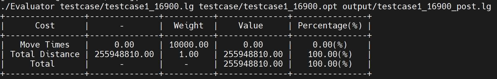

# Legalizer of Multibit Flip-Flop Banking

## Overview
This project focuses on flip-flop banking in physical design to reduce power consumption and area while considering timing constraints.

Many optimization techniques lead to cell overlap, resulting in illegal placement. A fast local legalizer is needed to check legality efficiently and allow frequent optimization attempts.

The cost function is defined as:

$$
cost = \left( \sum_{i=1}^{|C|} \alpha \cdot x_i \right) + \beta \cdot y
$$


where:

$$
\begin{cases}
|C| = \text{cardinality of set } C \\
\alpha = \text{parameter1} \\
x_i = \text{number of cell moves in } P \\
\beta = \text{parameter2} \\
y = \text{total displacement from initial position (Manhattan Distance)}
\end{cases}$$

For more details, refer to: [https://hackmd.io/@coherent17/PDA_Lab3](https://hackmd.io/@coherent17/PDA_Lab3)

## Files Structure
```sh
📂 Lab4/
├── 📁 gif/         # gif 
├── 📁 inc/         # Header files
├── 📁 mp4/         # mp4
├── 📁 obj/         # Compiled object files (generated during compilation)
├── 📁 output/      # Output txt files
├── 📁 src/         # Source files
├── 📁 testcase/    # Testcases
├── 🛠️ Evaluator    # For verification and evaluation
├── ⚙️ Makefile     # Build automation script
└── 📜 main.cpp

```

## Compilation
To compile all source files, run the following command:
```sh
make
```
This will compile all source files and generate an executable file - Legalizer.

## Execution
To process the program, use:
```sh
make exe
```

## Verification & Evaluation
To verify and evaluate, use:
```sh 
make check
```

If there are no errors, you will see a result similar to the image below.


## Clean Up
To remove all compiled object files, run:
```sh
make clean
```
This will delete the obj/ directories as well as the executable files.

## Results

Generated from [GenMP4](https://github.com/coherent17/Optimizer-and-Legalizer-Co-optimization/tree/main/GenMP4)

| testcase1_ALL0_5000                                                                                   |
|:-----------------------------------------------------------------------------------------------------:|
||


| testcase1_MBFF_LIB_7000                                                                                   |
|:---------------------------------------------------------------------------------------------------------:|
||


