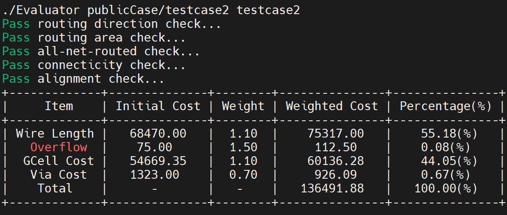
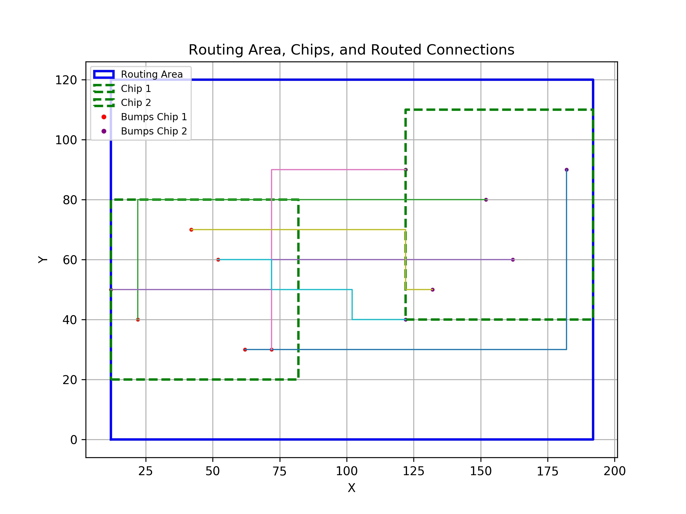
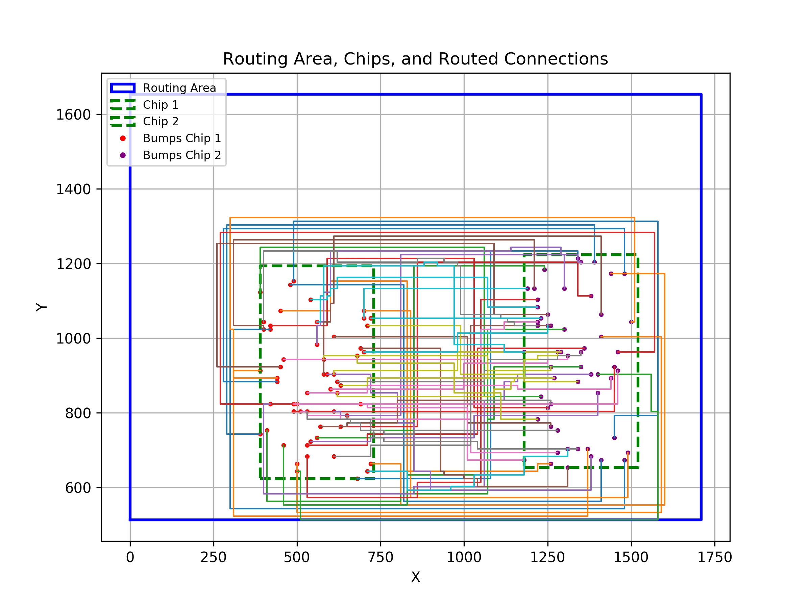

# Die-to-Die Global Routing using A* Search

## Overview
This project implements a Die-to-Die Global Router (D2DGRter) using A* Search Algorithm to efficiently determine optimal routing paths between bumps on two separate chips.

The cost function is defined as:

$$ Cost=α⋅WL+β⋅OV+γ⋅CellCost+δ⋅ViaCost $$

where:
- WL = Wirelength (HPWL)
- OV = Overflow (when nets exceed edge capacity)
- CellCost = Congestion penalty
- ViaCost = Cost of vias

For more details, refer to: [https://hackmd.io/@krmb/PDA_Lab4](https://hackmd.io/@krmb/PDA_Lab4)

## Implementation
This project employs A* Search Algorithm to efficiently find minimum-cost paths between bump pairs while respecting routing constraints.
- A* Search Algorithm – Combines Dijkstra’s Algorithm with a heuristic function for faster convergence.

## Files Structure
```sh
📂 Lab4/
├── 📁 drawing/     # Layout images 
├── 📁 inc/         # Header files
├── 📁 layout/      # txt files for visualization
├── 📁 obj/         # Compiled object files (generated during compilation)
├── 📁 output/      # Output txt files
├── 📁 src/         # Source files
├── 📁 publicCase/  # Testcases
├── 🛠️ Evaluator    # For verification and evaluation
├── ⚙️ Makefile     # Build automation script
├── 🖥️ draw.py      # Python script for visualization
├── 🖼️ draw.sh      # Script to generate images automatically
└── 📜 main.cpp

```

## Compilation
To compile all source files, run the following command:
```sh
make
```
This will compile all source files and generate an executable file - D2DGRter.

## Execution
To process the program, use:
```sh
make exe
```

## Verification & Evaluation
To verify and evaluate, use:
```sh 
make check
```

If there are no errors, you will see a result similar to the image below.



## Generating Visualization Layout Images
After running the floorplanner, you can visualize the final floorplan layout using the provided scripts:
```sh
bash draw.sh
```

## Clean Up
To remove all compiled object files, generated output images and txt files, run:
```sh
make clean
```
This will delete the obj/ , output/ and layout/ directories as well as the executable files.

## Results
| testcase0                               |
|:---------------------------------------:|
|  |

| testcase1                               |
|:---------------------------------------:|
|  |

| testcase2                               |
|:---------------------------------------:|
|  |
